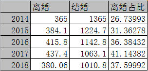

佛系青年寻爱记，bp 演讲稿

- 第二张：

小张呢，是一个有为青年，他考入了中国人民大学社会学，师从中国人民大学性社会学研究所所长潘绥铭教授。但是最近一个课题做的他很郁闷。 是什么课题呢？原来潘教授带着他进行了“中国人的性行为与性关系”的实地调查，这个调查从2000年开始每5年一次，已经进行到第4次了，每次调查的随机抽样方法、调查地点、调查方法、问卷内容都基本一致，因此具有历史可比性 。

15年的这次调查最让潘教授和小张意外的是婚外情比例。可以看到15年的男性出轨率是34.8%，女性15%。这个比例已经超过了美国的出轨率。

在预演的时候这个结论引起了很多质疑，我这里详细说一下。 第一个数据是美国17年的gss数据，这是很权威的数据，gss一般社会统计调查  其数据在美国仅次于美国人口普查局 的人口普查资料, 在社会科学领域的引用率居第二位。第二个数据来自美国婚姻和家庭治疗协会。第三个是做一个参考，数据来自一个侦探公司，他们的主要业务就是婚内出轨调查，所以是利益相关，而且第三个报告的样本数很少，只有200个，放这里主要是做一个参考。

国内的话，这方面的调查比较少，只找到了潘教授这个调查，样本分布在25个省市自治区的103个县级地理区域，涵盖18到61岁的、能识汉字的这个年龄段里的所有中国人，城市和农村，包括男女老少，15年合格样本共5136个，应该是比较可信的报告了。

与之对应，有一个参考数据，腾讯事实说 2016年的网络问卷，参与人数7万人，这个数据非常高，放这里也是仅做参考。

这里还有一个现象就是美国的出轨率这10多年来并没有大的波动，一直都是男21%，女13%左右（gss），而中国是激增的状态。

这张表里统计口径都是一致的，这里的出轨都是指 --- 结婚之后与非婚伴侣有过一次性关系就算有过出轨行为。

（美国比较热门的是老年人出轨，从05年开始，美国55岁以上老年人出轨率和离婚率都远远大于年轻人，

美国的出轨率是相对较低的  法国（43%)、挪威(41%)、比利时(40%)、西班牙(39%)、英国(36%)和芬兰(36%)，世界上最高的是泰国）

小张看到这数据都有点发怵，于是他又查看了一下现在中国的离婚情况。

- 第三张

  这里的数据来自国家统计局和民政部。可以看到结婚率在13年达到顶峰以后明显下滑，而离婚率一直在稳步上升，到17年粗离婚率已经达到千分之3.15, 17年的离婚人数437.4万对/结婚人数1063.1万对= 41.14%

  

  （这里的“粗离婚率”是一般指一定时期内，离婚的次数或离婚的对数除以总人口数。之所以称作粗离婚率，是因为在计算离婚率时，严格意义上分母应该是已婚人数而非总人口数，但由于统计总已婚人数较难，故采用总人口数。 ）

  18年 380.06/1010.8 =37.6% ，18年粗离婚率国家统计局还没有出年平均人口数，所以算不出来，但估算应该在3以下，比17年有所下降，因为18年的离婚人数比17年少了很多（57万对）。这里也可以看出，真正看了数据之后，可以看到结婚率虽然一直在下降，但离婚率其实17年的形式是最恐怖的，媒体现在对离婚这个问题大肆渲染有点一窝蜂蹭热点的感觉。

- 第四张

  我们看到中国17年的粗离婚率是千分之3.15，这大概是什么水平呢？小张找来了世界主流发达国家的粗离婚率历史数据（数据来源OECD ，经济合作与发展组织,简称经合组织 ）。可以看到只有美国的粗离婚率是在3以上，其他大都在3以下甚至2以下！

  而且各国在03-06年粗离婚率达到峰值，其后下跌趋势明显。发达国家的离婚率在下降！现在只有美国可以和中国比离婚率，而且美国在降我们在升。18年我们也出现了下降，长远趋势还要再看

- 第五张

  小张毕业了，追随自己的女朋友，来到了深圳，他发现自己每天忙的像一只陀螺，根本没什么时间陪女朋友。我们看到中国平均的休闲时间是2.27小时（17年，三年前14年是2.55小时），而深圳不到2小时。

  数据来自中国社会科学院财经战略研究院 ，美国的对比数据来自华尔街日报--12年（美国数据17年的我是有的，来自美国劳工局，但是他是把时间切的很碎，学习，看电视，玩游戏，社交等等都分开，free time包括哪些就没法算，不知道中国报告的统计口径，但说单项的话，17年美国人平均看电视的时间是2.77小时）

  我们再来看房价，这里数据全部来自NUMBEO，是最大的生活成本互联网数据库，中外统计口径是一致的。这个数据经过了MERCER(美世,全球领先的人才、健康、养老和投资咨询机构 )数据的交叉验证。

  房价收入比，是指住房价格与城市居民家庭年收入之比 ，一般认为3-6之间比较合理。

  美国放了3个城市的数据，美国有房产税，但就是在原数据上翻一倍，与我们的一线城市比还是望尘莫及。

  最后亲昵时间，是来自潘教授的全国调查，亲昵活动是指拥抱接吻等，经常进行日常亲昵的夫妻比例在10年达到高峰后，15年又减少到06年的水平了。这个数据是孤证，没有交叉验证，仅供参考。

  小张在这种环境之下，越来越焦虑，不敢消费，与女朋友的交流也越来越少。

- 第六张

  女朋友和小张分手了，“对不起，我和你在一起很焦虑，没有安全感，我们分手吧！“ 

  小张非常痛苦，但心里也想，不能怪我呀，这样的生活节奏、生活成本、怎么能让我有安全感呢

  社会上离婚率这么高，大家都不是一样焦虑浮躁。

  但冷静下来之后，小张想到所谓安全感总的来说还是内心的体验，不能全怪外界环境。

- 第七张

  小张对女朋友说的安全感耿耿于怀，开始寻找这方面的信息，由于他参加过阳志平老师的学术分析课，所以他不会去百度或公众号找这方面的文章，而知道要从学术入手，形成全局认识。

  小张认为安全感应该是属于心理学范畴。

  在心理学辞典里头，安全感的定义是：***

  Authur S.Reber阿瑟·S.雷伯 

  心理学辞典的作者

  

  安全感的概念最早见于佛洛伊德精神分析的理论研究。他是从不安全感的角度来研究，包括个体的创伤感、危险感和焦虑感。

  他认为，当个体所接到的刺激超过了本身控制和释放能量的界限时，个体就会产生一种创伤感、
  危险感，伴随这种创伤感、危险感出现的体验就是焦虑。

  后面这些都是精神分析学派的学者，不同方向和程度的发展了佛洛依德的理论。

  （社会文化精神分析的代表霍妮 (Karen Horney)深受弗洛伊德理论的影响，但她

  修正了弗洛伊德的生物决定论观点，强调社会文化因素对人的精神生活的重要作用

  

  人本主义精神分析学家弗洛姆(Erich Fromm)非常重视家庭环境对儿童人格的重

  要影响

  

  精神病学人际关系理论的代表人物沙利文特别重视人际关系

  

  奥地利精神分析学家埃里克森(E ．H ．Erikson)继承和扩展了弗洛伊德的儿童

  发展理论，创建了有关人的生命周期的八个心理社会发展阶段渐成说）

  

  除了精神分析学派，心理学中的人本主义学派也对安全感研究颇多。

  马洛斯 编制了安全感-不安全感问卷（S-I 问卷）。

  （马斯洛于 1942 年提出了心理安全感的动力理论，并提出心理健康标准的第一条就是个体要有充分
  的安全感

  人本主义心理学家马斯洛于 1942 年将动机满足分为安全型、归属型以及爱恋型
  三类，并由此提出了心理安全感的动力理论。在此基础上，他在 1943 年提出了著名
  的需要层次理论。将人的需要由低到高划分为五类，即生理需要、安全需要、归属与
  爱的需要、尊重的需要、以及自我实现的需要.马斯洛指出：如果生理需要相对充分
  地得到了满足之后，接着就会出现对安全的需要，分层不是非常严格，马斯洛也承认有时安全感的需求会胜过生理需求）

  

  按开智的信息分析策略应该是 学术>主题>关键词，小张先从心理学入手，但发现至今为止心理学没有建立许多有关安全感的理论。

  在理论建构方面，目前比较热门的与安全感相关的是依恋理论。

  Bowlby作为依恋理论的开山祖师，主要研究的是亲子依恋，Hazen&Shaver 在80年代对爱情进行了开创性研究，从此成人依恋成为依恋理论的研究热点。

  对安全感的可操作性研究有*******************

  

  心理安全感-不安全感问卷(Security-insecurity Test, S-I Test)

  不安全感自评量表(Self-Rating Feeling of Insecurity Scale, SRFIS） 

  心理不安诊断测验、安全感量表(Security  Questionnaire,  SQ)

  大学生心理不安全感问卷

  大学生心理安全感问卷

- 第八张

  在开智的信息分析课程中，强调概念要找有可操作性的定义，不要本质主义的定义，要做到这点，就必须把概念拆解维度，细化颗粒化。

  小张发现学术中安全感和不安全感是分开研究的，他从不同的角度来拆解安全感/不安全感的内涵和作用。

  注意在作用方面严重的不安全感会呈现病理性特征，而在创造力方面，并不是安全感越高就越好的。

  （深入一步，安全感与不安全感

  心理健康（神经质，官能症）

  认知风格（偏激、狭隘、多疑、走极端）

  中国精神分析治疗领域的领军人物丛中教授

  丛中，主任医师，教授，中国心理咨询与心理治疗专业委员会委员，北京大学精神卫生研究所教授。中国心理咨询与心理治疗专业委员会副主任委员，北京大学精神卫生研究所教授，北京大学临床心理中心副主任，精神医学博士）

  丛中教授在03年给安全感下了一个操作性更好的定义，安全感是*****************

  制定的安全感量表 有两个因子：人际安全感和确定控制感 ，各8题一共16题。

  马斯洛Is报表有 75提，而且里面的表达不太符合中国人的习惯， 这个报表与is报表呈显著相关，具有较好的效标效度和信度。

  （因子 1: 人际安全感, 共八个项目, 主要反映个体对于人际交往过程中的安全体验。

  因子 2: 确定控制感, 共八个项目, 主要反映个体对于生活的预测和确定感、控制感。）

  小张应用量表自测了一下自己的安全感，果然偏低。特别是人际安全感方面。

- 第九张

  小张发现依恋理论与安全感关系甚大，于是在开智校友群中讨论，一个开智学员小红告诉他依恋和安全感并不完全是一回事。他们开始一起研究依恋理论

  依恋（attachment）最初本是发展心理学中的一个名词,专指婴儿对母亲或主
  要照顾者的依恋，如今依恋理论已经扩展到了成人。

  attachment这个词是参考了奥地利比较心理学家，动物习性学的创始人 康拉德•洛伦茨发现的

  刚孵出的雏鸭对最早注意到的环境中会移动的客体，表现出跟随依附的行为（也就是印记 ）。

  /**    *************/

  （发展和认知学派将成人依恋定义为“成人关于童年期与父母关系的记忆和心理表征”,

  而人格和社会学派则将成人依恋定义为“个体与目前同伴的持续和长久的情感联系”,

  因此发展和认知学派主要研究父母与孩子的关系,而人格和社会学派则是研究成人与成人之间的关系。

  发展学派主要基于详细的编码访谈描述,而人格学派更广泛地采用自陈式报告。

  发展学派侧重分析一个人对依恋经历描述的一致性、可信度和模糊性的结构比例,

  而人格学派则侧重于分析一个人的认知、情感和自我观察行为的内容。

  ）

  小张比较感兴趣的是人格和社会学派。

  

  (安全基地：趋近行为、分离痛苦、避风港、安全基地)

  安全基地就像我们小时候玩的坦克大战的那个老巢，是安全感和信心的根基，鲍尔比的比喻是军队在外打仗，若总部受攻击陷落，在外的军队就会丧失战斗力。

  

  内部工作模式和动力加工模型

  （前者是个体习惯化的依恋风格，是依恋系统的功能模块在特殊的社会经验的逐步塑造下
  最终形成的稳定特质，是稳定的内部工作模式的外在表现形式；
  后者是暂时性的安全依恋启动状态，是威胁情境下依恋系统激活后的信息加工特性，
  是对依恋系统激活后动态加工特性的反映）

  Bowlby认为与依恋对象的互动可以储存在至少两种工作模式中

  依恋对象反应的表征（他人的工作模式）和

  自己值得被爱、能力的表征（自己的工作模式）

  分成这两点也是后面依恋类型的2个维度来源

  

  依恋类型

  这个恐怕是依恋理论最有名的部分了。

  

  发展路径 

  Bowlby背离了精神分析中的发展阶段理论，参考洛伦茨的理论建立了发展路径理论。安全类型的人从小就是安全的发展路径，而不是人人都必须刻板的经过口欲期 、肛欲期 、性蕾期 等阶段。

  

- 第十张

  小张和小红测试自己的依恋类型  

  如果只看百度知乎，或者做一些公众号小程序的测评，最多只能知道自己定性于哪一个区间，无法量化描述自己。很多人会认为依恋类型只是一个定性的类似人格分类的概念，而依恋类型实际上更倾向是一种人格特质，是定量可测的。并且依恋是针对不同对象有不同的依恋类型的，对父母，对爱人等，不是说一人只有一个类型 。

- 第十一张

  小张建立起新的人际关系---与小红一起 

  并且他们用所学到的知识建立与巩固亲密关系 

  

- 第十二张

  

- 第十三张

  

  - 欧美主流国家粗离婚率03-08年达到峰值，之后一直在下降，婚姻制度如果说要崩溃，恐怕至少没那么快

  

  - 在全球一般婚姻稳定性是和男性人口比例成正比的，男性越多这个国家的婚姻会越稳定，中国显然不是这样，据预测，到2020年，中国将有2400万男性未婚且无法找到妻子，这似乎并不能使已婚男性珍惜自己的婚姻。

    

  - 在婚姻领域，如今中国是比较自由宽松的，形式上已经简单到了一定的极致，比如香港人的结婚程序就比大陆要复杂一些，需要提前预约，交证明材料，领证当天要有2位证婚人，有律师见证的宣誓程序等等（海牙法）

    表现在结婚离婚程序简化，不再需要其工作地点或当地居民委员会的证明或确认，取消婚前身体检查（女方贞操保密）

    计划生育政策作用逐渐淡化，2013年开放单独，2016年1月1日起开放二胎，独生子女政策正式宣告终结，强制避孕节育也成为历史 。

  

  

  

  - 比如如果不分开，就很难回答安全感是不是越高越好这种问题，创新能力和安全感的关系，一些神级官能症和不安全感的关系等，安全感来自哪里，不安全感来自那里，不安全感非常强，呈现病理特征后要如何应对等等
  - 如果只看百度知乎，或者做一些公众号小程序的测评，最多只能知道自己定性于哪一个区间，**无法量化描述自己** 。会认为依恋类型只是一个定性的类似人格分类的概念，而依恋类型更倾向是一种人格特质，并且依恋是针对不同对象有不同的依恋类型的，对父母，对爱人等，说一人只有一个类型
  - 

  安全感研究述评 安莉娟, 丛中

  Asdhaffenberg 明确提出了不安全感的概念 , 并且认为不安全感与神经症的产生有密切的关系

  Aschaffenberg

  马斯洛在其研究后期，与Mittelenmn一起提出心理健康的标准中第一条就是个体要“有充分的安全感” （王登峰，张伯源，2000）。

  Mittelman

  

  威廉.布列茨教授(William Blaze)及其同僚所创的安全说体系最为完整

  这个人在acemap，谷歌学术，整个谷歌里头都找不到他的信息，他只存在于中文学术圈，中文论文引用全部来自江绍伦的《安全感的建造》，
  这本书据说是岭南学院出版社1992年出的，但网上也几乎没有资料。这个教授应该是有的，但他的英文名肯定有误。我花了大量时间寻找这个教授，一无所获。

  （William Bruce Cameron 学者发表过有关安全感的论文，但他影响力不大，而且是芝加哥大学的，William Blaze按论文中所说应该是多伦多大学的）

  系谱，起源，传播路径

  

  

  

  

  

  

  

  

  